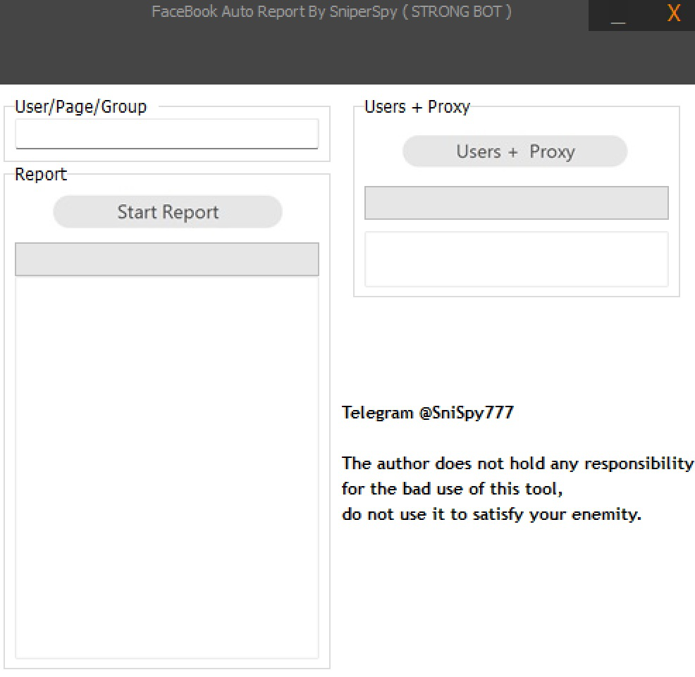

# facebook-reporting-bot
<p align="center"></p>

<h2 align="center">Join our telegram here > <a href="https://t.me/fbreporttool"></a></h2>

## What is a Bot/Tool for Reporting an Account or Page on FaceBook❓
   Definition of a Bot/Tool:.
  * <p>A bot/Tool is an automated software program designed to perform specific tasks online. In the context of social media platforms like FaceBook, bots can be programmed to report accounts or pages based on certain criteria.</p>
   Functionality of this Bot/Tool: 
* <p>Functionality of this Bot/Tool: When an account or page is massively reported, regardless of the content on the account or page, the account or page will be deleted anyway. On FaceBook reporting bots are typically used to flag accounts ormpages that violate community guidelines or exhibit spam-like behavior. the bot can submit reports without requiring human intervention.</p>


# How can i get this Bot/Tool or to report an account or page ❓
  * Join our telegram here > <a href="https://t.me/fbreporttool"></a>
  * Check all the proof.
  * Below each video you will see our contact starting with @ contact us on that username.
</pre>
</p>
</details>


**Legal Notice**

```console
I am not accountable for any of your actions.
```

----
